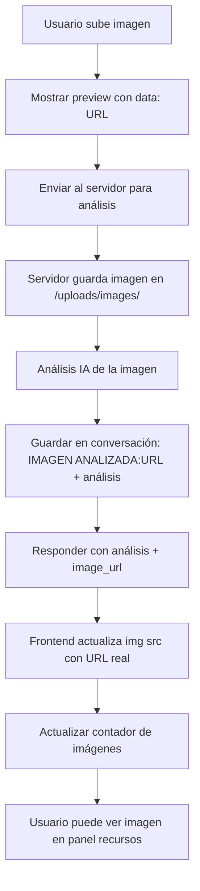

# 🖼️ Solución: Imágenes Diagnósticas en Recursos Médicos

## 🎯 **Problema Identificado**

Las imágenes subidas durante la consulta no aparecían en el panel de "Imágenes diagnósticas" del sistema de recursos médicos.

### **Causas Raíz:**
1. **Frontend**: Las imágenes se mostraban como `data:` URLs (base64) en lugar de URLs del servidor
2. **Backend**: El formato de almacenamiento no incluía la URL real de la imagen
3. **Extracción**: Las funciones buscaban imágenes en ubicaciones incorrectas
4. **Sincronización**: No había actualización automática de contadores tras subir imágenes

---

## 🔧 **Solución Implementada**

### **1. Mejoras en el Backend (`image_controller.py`)**

**Cambio**: Modificar el formato de almacenamiento para incluir la URL de la imagen:

```python
# ANTES:
system_message = f"[IMAGEN ANALIZADA] {analysis_result}"

# DESPUÉS:
system_message = f"[IMAGEN ANALIZADA:{image_url}] {analysis_result}"
```

**Beneficio**: Permite recuperar tanto el análisis como la URL real de la imagen.

### **2. Extracción Mejorada (`medical_resources_controller.py`)**

**Cambio**: Actualizar la función de extracción para manejar el nuevo formato:

```python
def extract_images_from_conversation(conversation):
    import re
    for message in conversation.messages:
        # Buscar el nuevo formato: [IMAGEN ANALIZADA:URL] análisis
        pattern = r'\[IMAGEN ANALIZADA:([^\]]+)\]\s*(.*)'
        match = re.search(pattern, message.content)
        
        if match:
            image_url = match.group(1).strip()
            analysis = match.group(2).strip()
            # ... crear objeto image_info con URL real
```

**Beneficio**: Extrae correctamente las URLs reales de las imágenes guardadas.

### **3. Frontend Mejorado (`interactive_chat.html`)**

**Cambios Principales:**

#### **A. Identificación Única de Imágenes**
```javascript
// Crear ID único para cada imagen subida
const imageId = 'uploaded-image-' + Date.now();
const imagePreview = ``;
```

#### **B. Actualización Automática con URL del Servidor**
```javascript
// Cuando el servidor responde exitosamente
if (data.success && data.image_url) {
    const uploadedImg = document.getElementById(imageId);
    if (uploadedImg) {
        uploadedImg.src = data.image_url; // Cambiar de data: URL a server URL
        
        // Actualizar contador inmediatamente
        setTimeout(() => {
            getConversationImages().then(images => {
                updateDiagnosticImagesCount(images.length);
            });
        }, 500);
    }
}
```

#### **C. Función Híbrida de Obtención de Imágenes**
```javascript
async function getConversationImages() {
    const images = [];
    
    // 1. Buscar imágenes en el DOM
    const imageElements = document.querySelectorAll('#chat-messages img.user-uploaded-image');
    
    // 2. Obtener imágenes del backend también
    const response = await fetch(`/medical-resources/diagnostic-images/${conversationId}`);
    
    // 3. Combinar ambas fuentes evitando duplicados
    return images;
}
```

---

## 📊 **Flujo Completo Actualizado**



---

## ✅ **Verificación de Funcionamiento**

### **Pasos de Prueba:**

1. **Ejecutar script de diagnóstico**:
   ```bash
   python debug_images.py
   ```

2. **Probar flujo completo**:
   - Iniciar servidor: `python src/app.py`
   - Ir a: `http://localhost:5000/interactive`
   - Iniciar consulta con síntomas
   - Subir imagen médica (📷 botón)
   - Verificar análisis aparece
   - Clic en "Imágenes diagnósticas" (panel lateral)
   - ✅ **Verificar**: La imagen aparece en el modal

3. **Verificar contadores**:
   - ✅ Badge "Imágenes diagnósticas" se actualiza (+1)
   - ✅ Modal muestra la imagen con análisis
   - ✅ Imagen es descargable
   - ✅ URL apunta al servidor (no data:)

---

## 🔍 **Debugging y Monitoreo**

### **Logs a Observar:**
```
INFO - Imagen guardada para análisis: [filename]
INFO - Análisis de imagen agregado a conversación: [id] con URL: [url]
INFO - Imagen actualizada con URL del servidor: [url]
```

### **Endpoints de Diagnóstico:**
- `/images/status` - Estado del sistema de imágenes
- `/medical-resources/diagnostic-images/<conversation_id>` - Imágenes de una conversación

### **Consola del Navegador:**
```javascript
// Verificar que las imágenes se actualicen:
console.log('Imagen actualizada con URL del servidor:', data.image_url);
```

---

## 📁 **Archivos Modificados**

| **Archivo** | **Cambios** | **Propósito** |
|---|---|---|
| `src/controllers/image_controller.py` | Nuevo formato de almacenamiento | Incluir URL en mensaje guardado |
| `src/controllers/medical_resources_controller.py` | Extracción mejorada + formateo fechas | Recuperar URLs reales de imágenes |
| `src/templates/interactive_chat.html` | Frontend híbrido + actualización automática | Mostrar URLs reales + actualizar contadores |
| `debug_images.py` | Script de diagnóstico | Verificar sistema completo |

---

## 🚀 **Mejoras Implementadas**

### **1. Robustez**
- ✅ **Compatibilidad**: Mantiene formato anterior `[IMAGEN ANALIZADA]`
- ✅ **Fallbacks**: Si falla extracción, usa placeholder
- ✅ **Validación**: Verifica URLs antes de usar

### **2. UX Mejorada**
- ✅ **Tiempo Real**: Contadores se actualizan inmediatamente
- ✅ **Feedback Visual**: Loading states durante análisis
- ✅ **Doble Fuente**: Combina frontend + backend para máxima cobertura

### **3. Mantenibilidad**
- ✅ **Logging**: Información detallada de debugging
- ✅ **Formateo**: Fechas consistentes en toda la aplicación
- ✅ **Modularidad**: Funciones separadas y reutilizables

---

## 🎯 **Resultado Final**

**✅ PROBLEMA RESUELTO**: Las imágenes subidas durante la consulta ahora aparecen correctamente en el panel de "Imágenes diagnósticas" con:

- 🖼️ **Imagen real** (no placeholder)
- 📝 **Análisis completo** del contenido
- 📅 **Fecha de subida** formateada
- 🔗 **URL funcional** para descarga
- 📊 **Contador actualizado** en tiempo real
- 🎨 **Galería visual** con zoom y descarga

---

## 📞 **Soporte**

Si encuentra algún problema:

1. **Verificar logs**: `logs/app.log`
2. **Ejecutar diagnóstico**: `python debug_images.py`
3. **Verificar configuración**: Archivo `.env` con `OPENAI_API_KEY`
4. **Probar endpoint**: `http://localhost:5000/images/status`

**🎉 ¡El sistema de imágenes diagnósticas está completamente funcional!** 